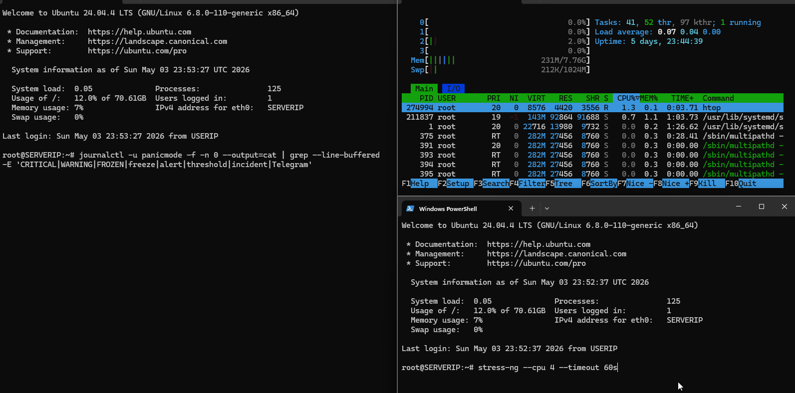

# PanicMode

> **PanicMode freezes broken Linux processes instead of restarting them.** When something goes sideways on your server, `SIGSTOP` keeps the broken state intact so you can debug it — instead of a restart cycle that wipes the evidence before you log in.
>
> Action-first, not yet-another-monitor: it bans brute-forcers, freezes runaways, snapshots state, and pings you on Telegram / Discord / ntfy / email — all locally, single ~9 MB Rust binary, no SaaS phones home.

[](https://github.com/BorisYamp/panicmode)
[](https://github.com/BorisYamp/panicmode)
[](https://www.rust-lang.org)



```text
[CRITICAL] CPU Spike: 100.0% (threshold: 95%) | server: 198.51.100.7
  → snapshot saved /var/log/panicmode/snapshots/panicmode-snapshot-1777330622.txt
  → FROZEN: stress-ng-cpu (pid 13006, cpu 101.7%)
  → Telegram alert delivered

[CRITICAL] SSH Brute Force: 91 fails from 161.132.4.167(6), 198.51.100.1(35)
  → block_ip → iptables -I INPUT 1 -s 161.132.4.167 -j DROP
  → block_ip → iptables -I INPUT 1 -s 198.51.100.1 -j DROP
```

Most server monitors page you. PanicMode pages you _and_ buys you 60 seconds to look at the snapshot before the box is back to a known-good state. Built for solo operators and small teams who run their own boxes and want active defence without standing up a Wazuh/ELK stack.

**Status:** v0.1.1, Linux-only, single binary + sample systemd unit. Hardened across 4 review rounds before tag — see [CHANGELOG](CHANGELOG.md) for the autopsy.

**On a live VPS (7+ days, alongside fail2ban):** 115 unique source IPs blocked over 1,790 ban events, 13,191 SSH brute-force attempts repelled, ~27 MB RAM, ~1 % CPU. Zero crashes, zero false positives. Full ASN/country breakdown in [`docs/threat-stats.md`](docs/threat-stats.md).

---

## What It Does

- **Monitors** CPU, memory, disk, network connections, SSH auth failures, file modifications, and custom metrics
- **Detects** threshold breaches and anomalies (spikes, suspicious IPs, brute-force attempts) with built-in dedup and rate-limit
- **Acts** immediately — freeze runaway processes, block attacking IPs, take system snapshots, run user scripts
- **Alerts** you via Telegram, ntfy, Discord, email, or phone call (Twilio, experimental)
- **Persists** every incident to SQLite + replays IP blocks across reboots
- **Survives** failures — each task is supervised and restarted on crash; daemon hardened under systemd

---

## The Story

A small dev shop I know was losing about 30 minutes of work every morning for a week. One VPS ran their internal CRM — code mostly written by juniors, no on-call rotation.

Two failure modes were grinding through them, alternating night by night:

1. The CRM kept getting hit by DDoS probes and brute-force traffic. Their only defence was a country-level firewall — it helped a little, but determined attackers routinely got around it.
2. The juniors would push small mistakes that the already-stressed box couldn't absorb. A bug that should have been a 5-minute fix would knock everything over instead.

The scary part wasn't that the server kept going down. It was that **the only way to know whether it was down was to log in and check by hand**. The office opened at 7am, so they settled into a daily 6am ritual: somebody had to connect to the box from home an hour before the doors unlocked, just to verify the CRM was still alive. The ritual itself became the new problem — someone always had to be the early-rising server-babysitter, every day, including weekends. And on the mornings when the box wasn't alive, the chain would start: that person called the manager, the manager called a friend who happened to be a mid-level engineer somewhere else, that friend SSHed in out of goodwill and restarted everything by hand. Up to 30 minutes of every workday was burned on this routine before the team could even begin. The company was losing money the whole time the chain was running.

They asked me for a solution with one hard constraint: **no extra servers, no SaaS subscriptions, no recurring costs, nothing new to secure.** Whatever it was had to run on the same VPS they already paid for, in the same single process. PanicMode is what came out of it — three priorities, in this order:

1. **Get a human onto the box the moment something breaks** — without paying for an uptime monitor and without routing alerts through anyone else's infrastructure. Telegram is already in everyone's pocket; the box sends the message itself, nobody else is in the loop, nothing recurring to pay for.

2. **Auto-handle the obvious stuff** so the human doesn't have to be the first responder. SSH brute-force / DDoS sources get iptables-banned at the first round of failures.

3. **Freeze the broken process, don't kill it.** This is the part I'm most proud of, and it does two things at once:
   - **The rest of the box stays alive.** A runaway process gets `SIGSTOP`'d before it eats all the CPU and RAM and takes the whole server down with it. The CRM keeps responding for everyone else; the team can deal with the incident during business hours instead of at 2am.
   - **The logs survive.** When a process crashes hard, its in-flight log buffers usually don't get a chance to flush to disk before the restart cycle wipes everything. With `SIGSTOP`, the process stays in memory exactly where it was — logs, stack, file descriptors all intact. The engineer logs in to a frozen-in-place crime scene, not a clean restarted box that already lost its clues.

That last point — both halves of it — is the difference between a 5-minute fix and a 4-hour incident.

---

## Why PanicMode (and not X)?

The host-monitoring space is crowded, and most options are heavier than PanicMode. That's intentional, not a limitation — and it's worth understanding the trade-off before you choose.

Tools like Falco, Wazuh, and Datadog are built on the assumption that **the more you observe, the safer you are**. Every syscall, every metric, every file modification — recorded, indexed, alerted on. That's genuinely powerful when you have a team to triage the firehose. It also means most single-VPS setups end up muting 90 % of the alerts inside a month.

PanicMode bets the other way. Most of what a healthy server does is fine and doesn't need a watcher. What you actually want is for the server **not to die quietly** — to make noise when something is genuinely critical, and to act before "critical" turns into "down for four hours overnight." So PanicMode watches less, alerts less, and *acts* directly when it has to.

Both philosophies are valid. Pick the one that matches the temperament of your team and the size of what you're protecting.

| Tool | What it does well | Where PanicMode trades differently |
|---|---|---|
| **fail2ban** | SSH brute-force banning, mature, battle-tested | fail2ban does one thing very well. PanicMode goes wider — bans IPs *and* freezes runaway processes, takes snapshots, and routes alerts to Telegram / Discord / ntfy / email / phone, all in one binary and one YAML. They also coexist happily; PanicMode runs alongside fail2ban on its own production VPS. |
| **monit** | Process restart, simple, battle-tested | Same shape as PanicMode but C-era ergonomics. PanicMode is async-Rust, parses journald with a kernel-attributed unit filter (auth log can't be `logger`-spoofed), and ships modern alerting out of the box. |
| **Wazuh** | Full SIEM, enterprise-grade audit and compliance | Wazuh wants Elasticsearch + a manager + agents per host; PanicMode is one ~9 MB binary, one YAML, one systemd unit. Different decision about how much infrastructure you want on top of your infrastructure. |
| **Falco (CNCF)** | Kernel-level syscall audit, exceptional visibility, deep Kubernetes integration | Different temperament rather than different scope. Falco records and emits — every syscall, every container event — and lets a separate responder (Falcosidekick + a controller, or your own) decide what to do. PanicMode watches less and acts immediately, in-process. Falco gives you everything to look at; PanicMode tries to mean less to look at. |
| **Datadog / hosted APM** | Polished UX, hosted, scales to anything | $15-$30 per host per month and your metrics flowing to someone else's wire. PanicMode is self-hosted with no phone-home, no SaaS, no monthly bill. |

PanicMode and these tools aren't strictly competing — most coexist fine. The thing that's specific to PanicMode is **active mitigation as a default, not an add-on**. If you find a row above that's wrong or unfair, [open an issue](https://github.com/BorisYamp/panicmode/issues) — these tools all evolve and the comparison will need updates.

---

## Quick Start

### Install (pre-built binary, recommended)

x86_64 Linux, ~9 MB total. Verify the SHA256SUMS if you care.

```bash
curl -L https://github.com/BorisYamp/panicmode/releases/download/v0.1.1/panicmode-v0.1.1-x86_64-linux.tar.gz | tar xz
sudo mv panicmode panicmode-ctl /usr/local/bin/
```

### Or build from source

```bash
# Requires Rust 1.88+ (curl https://sh.rustup.rs -sSf | sh)
git clone https://github.com/BorisYamp/panicmode.git
cd panicmode
cargo build --release
sudo cp target/release/panicmode /usr/local/bin/
sudo cp target/release/panicmode-ctl /usr/local/bin/
```

### Minimal Configuration

Create `/etc/panicmode/config.yaml` — ten lines is enough to start:

```yaml
monitors:
  - name: "Critical CPU"
    type: cpu_usage
    threshold: 95
    actions: [snapshot, alert_critical, freeze_top_process]

alerts:
  critical: [{ channel: telegram }]

integrations:
  telegram: { enabled: true, bot_token: "YOUR_TOKEN", chat_id: "YOUR_CHAT" }
```

That gives you: alert + snapshot + freeze when CPU crosses 95%, sent to Telegram. Add more monitors (memory / disk / SSH brute-force / file changes) by copying the block — see [`examples/config.yaml`](examples/config.yaml) for everything.

### Run

```bash
sudo panicmode /etc/panicmode/config.yaml
```

Logs go to `/var/log/panicmode/panicmode.log` (daily rotation) and stdout. Override log level with `RUST_LOG=debug`.

See [QUICKSTART.md](QUICKSTART.md) for detailed setup of each alert channel.

---

## Try It on Windows (Docker)

The [`docker-win`](https://github.com/BorisYamp/panicmode/tree/docker-win) branch contains a ready-to-run Docker Compose setup with a pre-built test configuration — no Rust toolchain required.

```bash
git clone -b docker-win https://github.com/BorisYamp/panicmode.git
cd panicmode
docker compose up
```

That's it. PanicMode will start, begin collecting metrics from inside the container, and you will see alerts firing in the console. Everything works out of the box — no configuration needed to verify the system is alive.

> **Note:** On Windows, Docker Desktop with WSL2 backend is required.

---

## Alert Channels

| Channel | Free | Setup time |
|---|---|---|
| Telegram | ✅ | ~2 min |
| ntfy (push) | ✅ | ~1 min |
| Discord webhook | ✅ | ~2 min |
| Email (SMTP) | ✅ | ~5 min |
| Twilio phone call | 💰 ~$1/mo | ~5 min |

---

## What Gets Monitored

| Monitor type | What it tracks | Source |
|---|---|---|
| `cpu_usage` | CPU % over a rolling window | sysinfo |
| `memory_usage` | RAM utilization | `/proc/meminfo` |
| `swap_usage` | Swap utilization | `/proc/meminfo` |
| `load_average` | 1/5/15 min load averages | `/proc/loadavg` |
| `disk_usage` | Per-mount disk fill % | sysinfo |
| `disk_io` | Per-device I/O `%util` (NVMe-friendly tuning recommended) | `/proc/diskstats` |
| `connection_rate` | New connections per second | `/proc/net/tcp[6]` |
| `auth_failures` | Failed SSH logins + brute-force IPs | **journald** with `_SYSTEMD_UNIT=ssh.service` filter (kernel-attributed, can't be spoofed via local `logger`) |
| `file_monitor` | Modifications under watched directories | inotify (`notify` crate) |
| `custom` | Output of your own script (number or JSON `{"value": …}`) | shell command |

---

## Protective Actions

When an incident fires, PanicMode runs the actions you list on that monitor. v0.1.0 ships:

- **`freeze_top_process`** — SIGSTOP the top CPU offenders. Two safety floors:
  - **Hardcoded protection** for `sshd`, `systemd`, `init`, `kthreadd`, `dbus`, `getty`, `panicmode`, plus PanicMode's own tokio runtime threads and Linux kernel threads. A misconfigured `mass_freeze.yaml` can't lock you out of the box.
  - **`top_cpu.min_cpu_to_freeze`** in `mass_freeze.yaml` (default **50.0%**) — processes below this CPU% are never frozen, even if they're top-N at the moment. Stops the action from catching observation tools (htop, journalctl, your editor) that briefly land in "top of remaining" after the actual culprits at 100% have already been frozen. Tunable per deployment: lower it (e.g. 30.0) for more aggressive mitigation, raise it (e.g. 80.0) if your normal load is high.
- **`block_ip`** — Calls your firewall script per public IP extracted from the incident. Blocks persist in SQLite and replay through `restore_blocked_ips` after reboot. Manage with `panicmode-ctl list` / `panicmode-ctl unblock <IP>`. Reference scripts in [`examples/`](examples/) use `iptables` and are idempotent.
- **`snapshot`** — Capture `ps`, `ss`, `free`, `df`, `uptime` to a timestamped file under `snapshot_dir`.
- **`run_script`** — Execute any user script. Incident context arrives as env vars `PANIC_INCIDENT_NAME`, `PANIC_SEVERITY`, `PANIC_DESCRIPTION`, `PANIC_DETAILS`, `PANIC_THRESHOLD`, `PANIC_CURRENT_VALUE` (each capped at 8 KB). **Never `eval` these in your script** — they may contain attacker-influenced text.
- **`alert_critical` / `alert_warning` / `alert_info`** — Route to AlertDispatcher; sent over the channels configured under `alerts:`.

**Documented in `examples/config.yaml` but not yet implemented** — the parser accepts them and the daemon prints a clear "NOT YET IMPLEMENTED" warning at startup; until shipped they no-op:

| Action | Status | Workaround |
|---|---|---|
| `mass_freeze` | not yet | use `freeze_top_process` |
| `mass_freeze_top` | not yet | use `freeze_top_process` |
| `mass_freeze_cluster:<name>` | not yet | use `freeze_top_process` |
| `kill_process` | not yet | `run_script` with `kill -KILL <pid>` |
| `rate_limit` | not yet | `run_script` with `iptables`/`nft` |

---

## Configuration Reference

See [examples/config.yaml](examples/config.yaml) for a fully-annotated example.

Key sections:

```yaml
storage:        # paths for DB, snapshots, logs
monitors:       # which metrics to watch and thresholds
alerts:         # Telegram / email / Discord / ntfy / Twilio
integrations:   # credentials for each alert channel
performance:    # polling intervals, timeouts
firewall:       # block_ip script paths, whitelist, restore_on_startup
actions:        # per-action settings (script paths, etc.)
```

For process freeze whitelist, create `/etc/panicmode/mass_freeze.yaml` (see [examples/mass_freeze.yaml](examples/mass_freeze.yaml)).

---

## Architecture

PanicMode runs five supervised async tasks plus one auxiliary (ctl socket):

```
MonitorEngine ──metrics──▶ Detector ──incidents──▶ IncidentHandler
                                                         │
                                               ActionExecutor  AlertDispatcher
                                                    │    │
                                             FirewallAction  (other actions)
                                                    │
                                             IncidentStorage (SQLite)
                                                    │
                                             CtlServer ◀── panicmode-ctl (CLI)
                                          (Unix socket, aux)
```

See [arch.txt](arch.txt) for the full architecture document.

---

## Roadmap

Ordered by likelihood of landing first:

- **Implement the no-op actions** above — `mass_freeze` / `mass_freeze_top` / `mass_freeze_cluster:<name>` / `kill_process` / `rate_limit`
- **SIGHUP hot-reload** so config changes apply without `systemctl restart` (~1-2 s gap today). Needs an `arc-swap` migration.
- **Rename `Many Connections` semantics** — name suggests absolute count but the metric is rate (new connections per second). Either rename or add an absolute-count monitor type.
- **First-class IPv6 brute-force testing path** — IPv6 components are wired (the `block_ip.sh` reference handles `:` addresses), but end-to-end testing on this VPS keeps hitting `sshd MaxStartups` / fail2ban rate-limits before we cross the threshold. Need either a controlled second host or a synthetic injection harness.
- **NVMe-friendly disk_io metric** — `time_doing_io_ms` is queue-time-based; on NVMe with high parallelism even saturated workloads stay under 50%. Either expose IOPS/bandwidth as separate monitor types, or document the expected threshold range for SSD/NVMe deployments.
- **Twilio coverage** — currently optional, untested in v0.1.0.

PRs welcome on any of these, or open an issue first to discuss the design.

---

## Acknowledgements

PanicMode v0.1.0 went through a 4-round hardening pass before this release. The full story is in [CHANGELOG.md](CHANGELOG.md); commits on the merged `production-hardening-2026-04` branch each carry a self-contained explanation of one or more of the 28 fixes. Highlights worth singling out:

- **Log-injection fix (#19)** — auth monitor now reads journald with `_SYSTEMD_UNIT=ssh.service` filter, closing a path where any local non-root user could `logger`-spoof a brute-force entry and trick PanicMode into iptables-banning arbitrary public IPs.
- **State-across-Clone bug family (#20–#22)** — three monitors maintained per-tick state via `#[derive(Clone)]`. Each clone updated its own state and was dropped, so the original baseline never moved → `disk_io` permanently 0%, `connection_rate` permanently 0, `auth_monitor` re-reading the entire log every tick. Fixed by sharing state via `Arc<Mutex<>>`.
- **systemd hardening + iptables (#13/#14)** — the unit's `RestrictAddressFamilies` blocked `AF_NETLINK` (which iptables needs to talk to kernel netfilter), and UFW's locks under `/run/ufw.lock` were unwritable under `ReadOnlyPaths=/`. Switched the example to direct `iptables`, broadened `ReadWritePaths`, added `AF_NETLINK` and `RuntimeDirectory`.

---

## License

Licensed under either of:

- [MIT License](LICENSE-MIT)
- [Apache License, Version 2.0](LICENSE-APACHE)

at your option.
